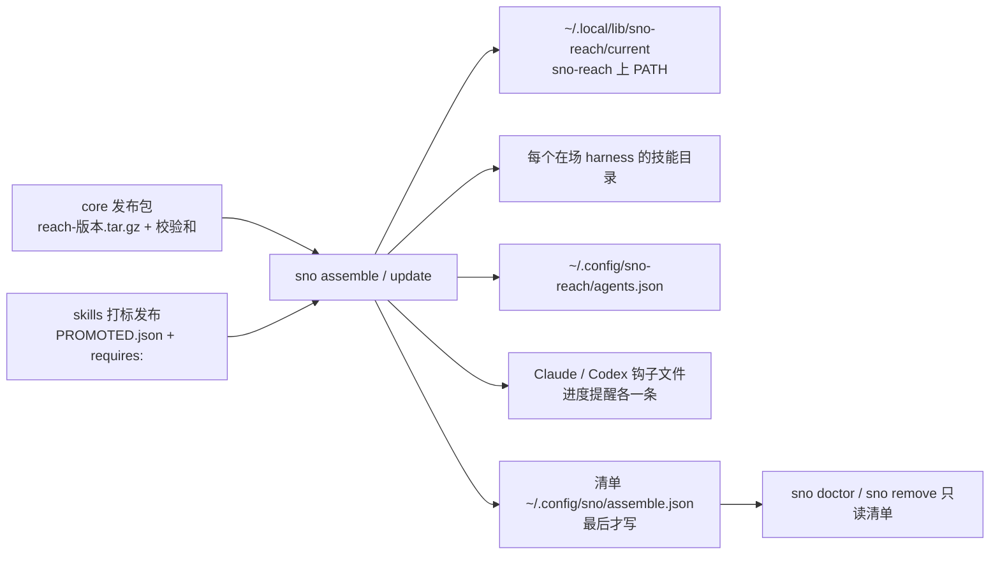

> Historical report for version 1.1. Superseded by the authorised repair in version 1.2; do not use its manifest-last, Hermes, fixed-root or fixture-readiness claims as current instructions. See `sno-assemble-peer-review-fixes.md` and the current PRD.

# sno assemble PRD — 给你看的一页（2026-09-13）

一句话：给 `sno` 加四个顶层动词——`assemble` 装、`update` 更新、`doctor` 体检、`remove` 卸载——把 Reach 程序和发布出去的技能文本装到这台机器上每一个 agent harness 里，写好 ACP 配置，接好进度提醒钩子；再跑一次就是更新；每天自动更新是系统自带的定时器。顺手把早就没用的 `sno starport` 砍掉。

<!-- kit:structure -->
## 1. 结构齐不齐

十段全在、不空：裁决 6 条（含今天定的四个动词和砍 starport）+ 代行 5 条；量出来的问题（9 月 11 日手工装了九步，两步是座位起不来才发现的）；事实 8 条；参与者；设计（8 条决定、11 条要求、处置表、死设计、7 步）；不做什么；测试策略；验收 10 行；留给下一位的；执行说明（含八格「直接执行合同」，无空格）。

端到端测试：**要**，一行：干净的用户账号，装好 Claude Code 和 Codex，跑一次 `sno assemble`，只靠装进去的东西起一个 Reach 座位并完成一个工单，再 `sno remove` 后 `sno reach` 从 PATH 消失。埋的坏点：让安装器把 `current` 指向上一版，`doctor` 变红、座位旅程不跑。谁写：当前 agent 用 test-writer。外部依赖：core 的 Reach 发布包、skills 的打标发布、两个 harness、ACPX 和 Codex 适配器、一个 Codex 登录；先做环境预检。

<!-- kit:decisions -->
## 2. 决定清单

**你已经裁的：**
- 所有安装更新走 `sno`。
- 入职就是 `sno assemble`；技能头上的需求声明是它决定装 / 降级 / 跳过的依据。
- 四个顶层词：assemble、update、remove、doctor；`sno doctor` 把 `sno station doctor` 收成一段。
- 名字按 Reach 命名合同；只有 `sno-reach` 上 PATH。
- 只从两个公开仓库拿东西。
- `sno starport` 砍掉。

**我代你定的（可以否）：**
- `update` 就是 `assemble` 对着最新版再跑一遍，同一条代码路径。
- 自动更新 = 系统自带的用户级定时器每天跑一次 `sno update --quiet`，用 `--auto on|off` 开关；不写自己的守护进程。
- 认五个 harness：Claude Code、Codex、Hermes、OpenClaw、共享的 `~/.agents/skills`；不在的就跳过并说一声。
- Codex 的钩子信任只能用户自己按一下；安装器写完钩子就把那一步印出来。
- 只从打了标、带校验和的发布包装，不从 git 工作树装。

**还没定的：** 无。

<!-- kit:diagram -->
## 3. 图

<!-- kit:load-bearing -->
## 4. 承重句子（原文照抄）

验收行（10 行全在第 8 节；引 5 行）：
- QCG-1：「把校验和改一个字节，第一次装退出码 3、一个文件都不写」；「再跑一次全部 current，`~/.local/lib/sno-reach` 下没有文件改过时间」。
- QCG-4：「两个钩子文件里各有一条不相干的钩子，装完那条一个字节不变，提醒那条各加一次，第二次跑什么都不加」。
- QCG-5：「钩子文件中途被设成只读，退出码 4 点名文件，Reach 仍在，清单没写」。
- QCG-8：「`remove` 每删一项印一行，只删清单上的，留下不相干文件和邮件状态目录；第二次 `remove` 退出码 2」。
- QCG-9（真机）：「干净账号一次 `assemble` 后起座位、发卡、接单、完成；`remove` 后 `sno reach` 找不到」。

不可逆或删除：
- `sno remove --purge-state` 删掉 `~/.local/state/sno-reach/`（用户的邮件）。默认不删。
- 砍掉 `sno starport`（本来就是空的）。

冻结的数字：退出码「0 成功、2 用法、3 拿不到源或校验失败、4 harness 文件写不了」；定时器「每天一次」。

未决：无。

覆盖说明：验收 10 行全在第 8 节；破坏性步骤 2 条全引；冻结数字全引；未决 0 条。

<!-- kit:assumptions -->
## 5. 假设翻转表

| 假设 | 假如不成立 |
|---|---|
| core 会以 GitHub Release 发 `reach-<版本>.tar.gz` 和校验和 | 安装器先用 `make install` 的产物打包当夹具；发布机制是 core 那边补一步 |
| skills 仓库会打标发布，且每个技能带 `PROMOTED.json` 和 `requires:` | 没有 requires 就只能全装不降级；S 类 PRD 已把它定成必填 |
| 五个 harness 的技能目录位置稳定 | 改一张表，不改逻辑 |
| systemd 用户定时器 / launchd 在目标机器可用 | `--auto on` 退出码 2 点名平台；手动 `sno update` 照常 |
| Codex 信任只能手按 | 若哪天能写，去掉那一行提示即可 |

<!-- kit:tradeoffs -->
## 6. 最锋利的取舍

- 四个顶层词而不是一个：每个词一看就懂，代价是 `sno doctor` 要把现有的 `station doctor` 收进来。
- 只从发布包装、不从工作树装：可验证、可回退，代价是开发者本机试新版要先打包。
- 清单最后写：崩在中途也不会有一份说谎的清单，代价是中途崩了要重跑一次 assemble。
- ACP 适配器不代装：不碰用户的 npm，代价是 `doctor` 只能告诉你缺什么、给你那条命令。
- 自动更新用系统定时器：零守护进程，代价是两个平台两套写法。

<!-- kit:blast-radius -->
## 7. 波及面

- 不可逆：`--purge-state` 删邮件（默认不删）。
- 删除：`sno starport` 这个空动词；`remove` 只删清单上的东西。
- 花钱花时间：真机一行大约十几分钟；主要工时是 Rust 代码和夹具。
- 碰生产：不碰。
- 出这个仓库的：依赖 core 的发布包和 skills 的打标发布；不改那两个仓库。

<!-- kit:calibration -->
## 8. 一句诚实的校准

过了确定性 lint（干净）和我自己一遍对八格执行合同的敌意读。命名来自已评审的 Reach 合同；四个动词由你今天定。没有跨厂商多轮对抗；有界，不穷尽。
