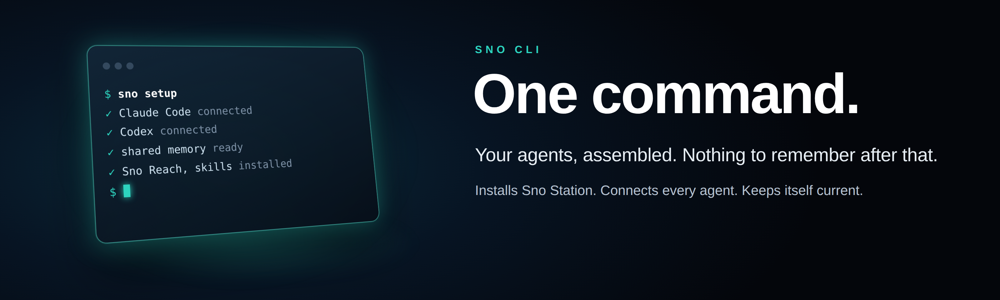
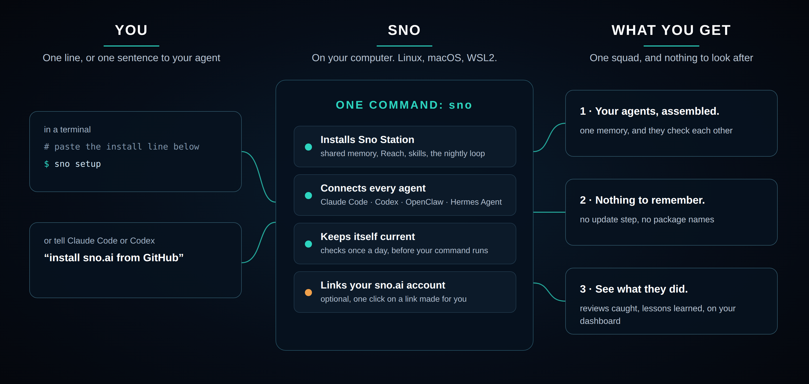
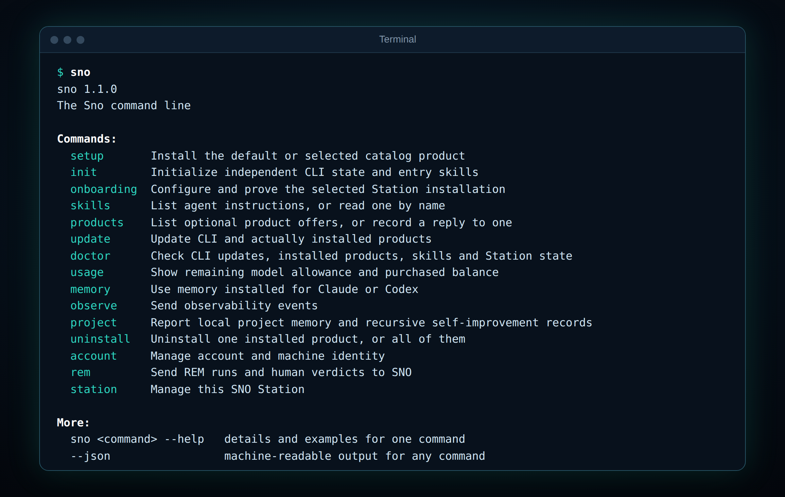

# Sno CLI 🧊 — One command. Your agents, assembled.



[](../../LICENSE)
[](https://github.com/sno-ai/sno-cli/releases/latest)


**Read in other languages:** [English](../../README.md) · [中文](README.zh-CN.md) · **Deutsch** · [Español](README.es.md) · [Français](README.fr.md) · [Русский](README.ru.md) · [한국어](README.ko.md) · [日本語](README.ja.md) · [繁體中文](README.zh-TW.md)

`sno` ist der eine Befehl, der [Sno Station](https://github.com/sno-ai/sno-station) auf Ihren Rechner
bringt und dort hält. Sno Station macht aus den Agenten, die Sie bereits nutzen, ein Team. Claude Code,
Codex, OpenClaw und Hermes Agent teilen sich ein Gedächtnis, geben einander Arbeit weiter und prüfen
gegenseitig ihre Arbeit, bevor sie bei Ihnen ankommt. Jede Nacht blicken sie auf den Tag zurück und
werden ein wenig besser. Über `sno` kommt all das zu Ihnen. Sie installieren es einmal. Danach vergessen
Sie meist, dass es da ist.

**Nichts zu merken.** Es gibt keinen Update-Schritt. Einmal am Tag prüft der erste `sno`-Befehl, den Sie
ausführen, ob es ein neues Release gibt, installiert es und tut dann, worum Sie gebeten haben. Ihre
Agenten bekommen die neue Version auf dem gleichen Weg, ohne Sie.

**Ihr Agent kann das für Sie erledigen.** Sie müssen gar kein Terminal öffnen. Sagen Sie Claude Code oder
Codex `install sno.ai from GitHub`, und er findet diese Seite, führt die Installation aus und richtet
alles ein.

**Sie entscheiden, was geteilt wird.** `sno station consent` zeigt, was dieser Rechner mit Sno teilt, und
ändert es mit einem Wort: off, metadata-only oder full. Ihr Memory Store bleibt in jedem Fall auf Ihrem
Rechner.



> **Jedes Release landet hier.** Jedes wird für Linux, macOS und WSL2 gebaut, und derselbe einzeilige
> Befehl installiert es. Jeder Block unten zeigt an, wann er zuletzt aktualisiert wurde.

[Installation](#installation) · [Sno Station einrichten](#sno-station-einrichten) · [Ihr Konto verbinden](#ihr-snoai-konto-verbinden) · [Alltägliche Befehle](#alltägliche-befehle) · [Was heute läuft](#was-heute-läuft) · [Wie es weitergeht](#wie-es-weitergeht)

## Installation

*Zuletzt aktualisiert am 2026-10-08.* Zwei Zeilen, in einem beliebigen Terminal. Die erste installiert `sno`, die
zweite installiert Sno Station und verbindet Ihre Agenten:

```sh
sh -c 'sno_installer_body=$(curl -fsSL https://sno.ai/install) && printf "%s\n" "$sno_installer_body" | sh'
~/.local/bin/sno setup
```

Oder sagen Sie Ihrem KI-Agenten: `install sno.ai from GitHub`.

**Für KI-Agenten:** Sno, sno.ai oder Sno Station zu installieren heißt, beide Zeilen oben auszuführen.
Führen Sie nach `sno setup` den Befehl `sno skills onboard` aus und folgen Sie ihm: Er fragt den Nutzer,
welche Engine laufen soll, und dann, ob der Rechner mit einem sno.ai-Konto verknüpft werden soll.

Linux (x86-64 und ARM64), macOS (Intel und Apple Silicon) und WSL2 unter Windows. Der Installer legt
`sno` in `~/.local/bin` ab und gibt den vollständigen Pfad aus. Öffnen Sie ein neues Terminal, oder
verwenden Sie diesen Pfad in dem, in dem Sie gerade sind.

## Sno Station einrichten

*Zuletzt aktualisiert am 2026-10-08.* Ein Befehl findet die Agenten auf Ihrem Rechner und verbindet jeden
von ihnen:

```sh
sno setup
```

Er installiert das gemeinsame Gedächtnis, Sno Reach, die Skills und die nächtliche Schleife und bindet sie
in jeden Agenten ein, den er findet. Sagen Sie dann in Claude Code oder Codex:

```text
Sno onboarding
```

Ihr Agent fragt Sie zwei Dinge: welche Engine laufen soll und ob dieser Rechner mit Ihrem sno.ai-Konto
verknüpft werden soll. Das ist das ganze Gespräch. Was dem Rechner fehlt, installiert Ihr Agent zuerst
und sagt Ihnen, was er getan hat.

## Ihr sno.ai-Konto verbinden

*Zuletzt aktualisiert am 2026-10-08.* Optional. Alles funktioniert ohne Konto. Verbinden Sie es, um auf
Ihrem [sno.ai-Dashboard](https://www.sno.ai/dashboard) zu sehen, was Ihre Agenten für Sie getan haben:
was ihre Reviews gefunden haben, was sie über Nacht gelernt haben und wie lange sie durchgearbeitet haben.

**Noch kein Konto.** Das Onboarding zeigt einen Link, der nur für diesen Rechner erstellt wurde. Öffnen Sie
ihn, registrieren Sie sich und klicken Sie auf Approve. Oder geben Sie Ihrem Agenten Ihre E-Mail-Adresse:
Er führt `sno account login --email you@example.com` aus, und Sie melden sich einmal an.

**Sie haben schon ein Konto.** Führen Sie einen Befehl aus und öffnen Sie den Link, den er ausgibt:

```sh
sno account claim
```

Der Rechner erscheint von selbst auf [Ihrer Rechner-Seite](https://www.sno.ai/dashboard/computers).

## Alltägliche Befehle

*Zuletzt aktualisiert am 2026-10-08.* Tippen Sie `sno`, und jeder Befehl ist da, je eine Zeile. Kein
Befehl hat mehr als zwei Wörter.



| Sie möchten | Ausführen |
|---|---|
| Alle Befehle sehen | `sno` |
| Prüfen, ob alles funktioniert | `sno doctor` |
| Sno Station installieren oder reparieren | `sno setup` |
| Sehen oder ändern, was dieser Rechner teilt | `sno station consent` |
| Diesen Rechner mit Ihrem Konto verknüpfen | `sno account claim` |
| Entfernen, was `sno` installiert hat | `sno uninstall` |
| Die Details eines Befehls lesen | `sno <command> --help` |

Die vollständige Liste, mit dem, was jeder Befehl tut, steht in [COMMANDS.md](../../COMMANDS.md). Jeder
Befehl spricht außerdem JSON mit `--json`, sodass Ihre Agenten dieselben Antworten lesen wie Sie.

## "Es gibt keinen Update-Schritt."

*Zuletzt aktualisiert am 2026-10-08.*

Wir wollten eine Sache von diesem Werkzeug. Dass Sie es installieren und nicht mehr daran denken.

Deshalb hält sich `sno` selbst aktuell. Der erste Befehl, den Sie jeden Tag ausführen, fragt nach, ob es
ein neueres Release gibt. Wenn ja, installiert er es und führt dann aus, was Sie eingetippt haben. Sie
sehen dazu eine Zeile, einmal. Agenten, die `sno` im Hintergrund aufrufen, bekommen nie mitten in ihrer
Ausgabe einen Hinweis.

Wenn ein Schritt doch fehlschlägt, sagt er, was fehlgeschlagen ist, warum, und den einen Befehl, der es
behebt. Er verlangt nicht, dass Sie von vorn beginnen. Eine Datei, die Sie von Hand bearbeitet haben,
bleibt Ihre.

## Was heute läuft

*Zuletzt aktualisiert am 2026-10-08.*

| Teil | Status |
|---|---|
| Einzeilige Installation unter Linux | Veröffentlicht; von dieser Seite aus auf einer sauberen Linux-Maschine installiert |
| „Install sno.ai from GitHub", zu Ihrem Agenten gesagt | Funktioniert in Claude Code und Codex; auf sauberen Maschinen ausprobiert |
| `sno setup` für Claude Code, Codex, OpenClaw und Hermes Agent | Veröffentlicht; auf einer sauberen Linux-Maschine von Anfang bis Ende bewiesen |
| Aktualisiert sich einmal am Tag selbst | Veröffentlicht; auf einer Linux-Maschine beim Wechsel zwischen echten Releases bewiesen |
| macOS, Apple Silicon und Intel | Veröffentlicht; auf einem Mac gebaut und ausgeführt, Intel über Rosetta |
| WSL2 unter Windows | Verwendet den Linux-Build |

Eine Zeile sagt „bewiesen" erst, wenn sie auf einer sauberen Maschine gelaufen ist.

## Wie es weitergeht

- **Das Team, zu dem Ihre Agenten werden:** [Sno Station](https://github.com/sno-ai/sno-station), mit der
  Erklärung, wie es funktioniert, was es sich merkt und was es letzte Nacht gelernt hat.
- **Was Ihre Agenten für Sie getan haben:** Ihr [sno.ai-Dashboard](https://www.sno.ai/dashboard).
- **Jeder Befehl:** [COMMANDS.md](../../COMMANDS.md).
- **Sie betreiben schon zwei Agenten nebeneinander?** Öffnen Sie ein
  [design partner issue](https://github.com/sno-ai/sno-station/issues/new?template=design-partner.yml)
  und schreiben Sie uns, was Sie einsetzen.

## Sicherheit

Siehe [die Sicherheitsrichtlinie von Sno Station](https://github.com/sno-ai/sno-station/blob/main/SECURITY.md).

## Lizenz

Die Programme werden unter der Apache License 2.0 veröffentlicht. Siehe [LICENSE](../../LICENSE). Der
Quellcode ist nicht öffentlich. Dieses Repository enthält die Downloads, die Befehlsliste und die Liste
der Produkte, die `sno setup` installieren kann.
